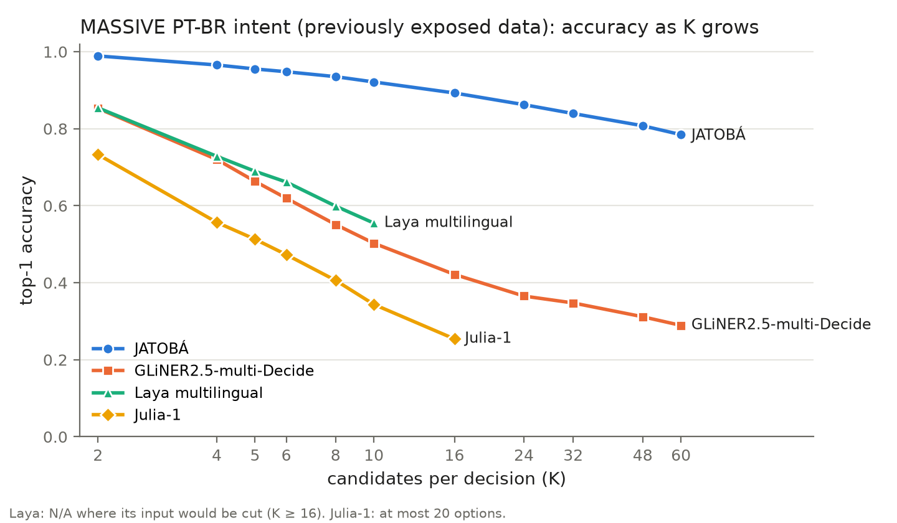
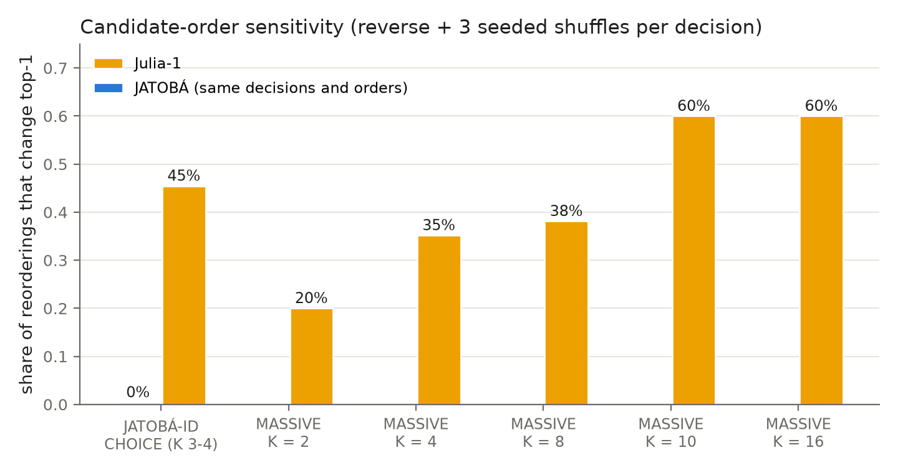

# JATOBÁ

**Joint Assessment of Typed Options with BERT Architecture**

JATOBÁ is a compact, non-generative model for typed probabilistic decisions in Brazilian Portuguese. Given a state (a
text), a question and a bounded set of described options, it returns a probability for every option.

```text
state + question + candidates
              ↓
           JATOBÁ
              ↓
     p(c1), p(c2), ..., p(cK)
```

- 169.1M parameters: a frozen [NorBERTo-base](https://huggingface.co/Itau-Unibanco/NorBERTo-base) encoder (149.0M) and a 20.1M-parameter trained decision path.
- Three primitives:
  - **NOUL** (is this proposition true?)
  - **CHOICE** (which of these options?)
  - **SCORE** (which level of an ordered rubric?)
- Candidate sets are an input, not a fixed label space. K is variable per decision and was evaluated up to 60.
- Candidates are encoded separately and interact through a positionless set transformer. Reordering the options only reorders the output; measured flips: 0.
- No text generation: one forward pass gives a normalized distribution keyed by the caller's candidate ids, so there is no answer text to parse.

Why not prompt a generative LLM? Generation returns text that must be parsed back into a choice, and its token probabilities are not a distribution over *your* options. JATOBÁ scores exactly the options you supply and returns their probabilities directly.

## Results

Frozen evaluation of JATOBÁ v1.1. External models received the identical semantic payload. All numbers are generated from `results/data/` by `scripts/reproduce_tables.py`.

<!-- results:start -->
| evaluation | metric | JATOBÁ | comparison |
|---|---|---|---|
| JATOBÁ-ID: unseen InferBR and BRIGHTER examples (trained families; 15,025 decisions Laya and GLiNER can also read) | hierarchical ε-CE ↓ | **0.508** | Laya 1.381, GLiNER 1.291 |
| MASSIVE intent, K = 60 candidates (previously exposed data) | top-1 ↑ | **0.785** | GLiNER 0.289; Laya N/A (input would be cut); Julia-1 N/A (at most 20 options) |
| NormasTCU (family never trained on) | ε-CE ↓ | **1.701** | uniform 1.099, Jev 1.498 |
| NormasTCU (family never trained on) | nDCG@10 ↑ | **0.717** | Jev 0.858, BM25 0.829 |
| JevBench public items (English) | accuracy ↑ | **0.329** | chance 0.318 |
<!-- results:end -->

Full tables are in [`results/tables/`](results/tables/):
- per-task results;
- the K curve;
- family shift with confidence intervals;
- latency;
- candidate-order sensitivity;
- JevBench;
- negative v2 results.





What these numbers do and do not show:

- **JATOBÁ-ID is in-distribution.** It holds unseen examples and groups from three of the six families JATOBÁ was trained on (InferBR, BRIGHTER, Community Alignment); the headline number uses the 15,025 InferBR and BRIGHTER decisions that Laya and GLiNER can also read (Julia-1 is reported on its own subset in Table 2). Strong results there show specialization to those families, not general decision-making.
- **Unseen families remain unsolved.**
  - On NormasTCU (legal relevance, never trained on), JATOBÁ is worse than a uniform guess in ε-CE, as is every evaluated probabilistic model.
  - Ranking quality (nDCG) and probability quality (ε-CE) diverge there.
- **No English transfer.** On the English JevBench public items, JATOBÁ is at chance level.
- **Julia-1 comparisons are scoped.** Julia-1 is weak *on this PT-BR evaluation under this protocol*. That is not a general statement about Julia-1.

See [`docs/limitations.md`](docs/limitations.md).

## Status

**Model weights are available on Hugging Face under CC BY-NC-SA 4.0: [huggingface.co/leoabreu288/jatoba-decision](https://huggingface.co/leoabreu288/jatoba-decision).**

- **Non-commercial:** the license is non-commercial, because the included NorBERTo-base encoder is CC BY-NC-SA 4.0.
- **Dataset terms:** the training datasets keep their own terms. ASSIN 2 was released for the research community without an explicit corpus license.

See [`docs/final_weight_license_audit.md`](docs/final_weight_license_audit.md) and [`ATTRIBUTIONS.md`](ATTRIBUTIONS.md).

## Usage

```bash
pip install -e .
```

```python
from jatoba import Jatoba

model = Jatoba.from_pretrained()  # downloads leoabreu288/jatoba-decision

result = model.decide(
    state="me acorda amanhã às sete, por favor",
    question="Qual categoria melhor descreve o pedido do usuário?",
    options={
        "alarm_set": "criar alarme: definir um alarme para um horário",
        "weather_query": "consultar o tempo: perguntar a previsão do tempo, a temperatura ou as condições climáticas",
    },
)
print(result.probabilities)  # {"alarm_set": ..., "weather_query": ...}
```

Rules of the interface:
- **SCORE:** options go from the lowest to the highest level, and `result.expected_level` is Σ i·pᵢ.
- **NOUL:** options are exactly `{"false": ..., "true": ...}`.
- **Context length:** contexts longer than `max_context_tokens` (default 256, the trained regime) raise an error unless you pass an explicit `truncation="keep_start"` or `"keep_end"`. Truncation is reported in the result.
- **Candidate length:** candidates are never truncated.

[`examples/`](examples/) covers all three primitives and variable K.

## Evaluation suite

The JATOBÁ evaluation suite is rebuilt from the upstream datasets at pinned revisions; this repository ships no upstream records. `scripts/build_benchmark.py` checks every rebuilt decision against the frozen content hash and refuses to write a block that differs.

```bash
pip install -e ".[benchmark]"
python scripts/build_benchmark.py
python benchmark/evaluate.py --block jatoba_id --predictions my_model.jsonl
```

Blocks (details in [`benchmark/BENCHMARK_CARD.md`](benchmark/BENCHMARK_CARD.md)):

| block | regime | decisions |
|---|---|---|
| `jatoba_id` | unseen examples of trained families (historical name PRISTINE) | 15,711 |
| `legacy_exposed` | data exposed during model development; never presented as held out | 12,585 |
| `shift_normastcu`, `shift_juristcu` | family shift: legal relevance, never trained on | 804, 2,246 |
| `gdev_faquad` | development diagnostic (used during v2 research) | 816 |

A separate final generalization set remains sealed for future model development.

## Repository

| path | contents |
|---|---|
| `src/jatoba/` | model, decision encoding, inference API, metrics |
| `benchmark/` | pinned sources, frozen transforms, manifests (ids + hashes), candidate dictionary, external-model adapters, evaluator |
| `results/` | frozen result data (`data/`), generated tables and figures |
| `docs/` | [architecture](docs/architecture.md), [methodology](docs/methodology.md), [reproducibility](docs/reproducibility.md), [limitations](docs/limitations.md), [research history](docs/research_history.md) |
| `scripts/` | benchmark builder, table generator, release checks |

Experiments were conducted under the internal project name NorDecision before the public JATOBÁ release. Frozen result files keep that name (for example `NorDecision_RAW`); `RAW` is the uncalibrated output and `M0` the frozen per-primitive temperature calibration.

## License and citation

- **Code:** the code in this repository is licensed under Apache-2.0 ([`LICENSE`](LICENSE)), which covers the code only.
- **Weights:** the model weights have a separate license, CC BY-NC-SA 4.0, on Hugging Face.
- **Upstream terms:** the NorBERTo-base license still applies, and the source datasets retain their own licenses.

Please cite with [`CITATION.cff`](CITATION.cff) and cite the upstream datasets you rebuild.
