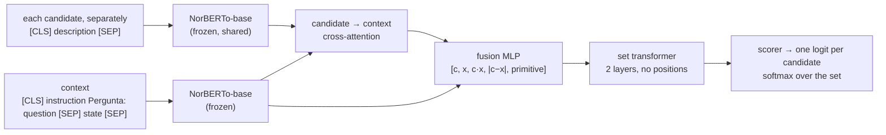

# Architecture

JATOBÁ scores a bounded set of described options against one state and question. Code: [`src/jatoba/model.py`](../src/jatoba/model.py).

## Components

| part | parameters | role |
|---|---|---|
| NorBERTo-base (ModernBERT) | 149,014,272, frozen | encodes the context once and every candidate separately |
| cross-attention (12 heads) + norms | 2,366,976 | each candidate's tokens read the tokens of its own decision's context |
| primitive embedding | 2,304 | NOUL, CHOICE or SCORE |
| fusion MLP | 3,542,016 | input 5 × 768: candidate vector c, context vector x, c·x, \|c − x\|, primitive |
| set transformer | 14,175,744 | 2 pre-norm encoder layers over the candidate vectors of one decision; no positional encoding |
| scorer | 769 | one logit per candidate |
| **total** | **169,102,081** (20,087,809 trainable) | |

## Why the order of the options does not matter

Candidates are encoded independently, attend to the context independently, and interact only through a transformer layer with no positional information. The model is therefore permutation-equivariant: reordering the candidates reorders the logits and changes nothing else. On the 22 JATOBÁ-ID CHOICE decisions used for Table 7 (reversed order plus three seeded shuffles each), no top-1 changed and the mean largest per-candidate probability change was 8.6e-9, which is floating-point noise. `tests/test_model.py` checks the property on a tiny random model.

K is not fixed. The same weights score two candidates or sixty; the evaluated range is 2–60.

## The three primitives

The primitive is a learned embedding plus a fixed instruction at the start of the context:

| primitive | instruction | candidates |
|---|---|---|
| NOUL | "Avalie se a afirmação é verdadeira ou falsa." | exactly `false`, `true` |
| CHOICE | "Escolha a alternativa que responde à pergunta." | K described options |
| SCORE | "Avalie a distribuição entre os níveis ordinais descritos." | ordered levels, lowest first |

The output is always a softmax over the supplied candidates. For SCORE, the expected level Σ i·pᵢ is also returned. The training loss was cross-entropy against the (possibly soft) target distribution; no ordinal loss is used, so the order of SCORE levels is carried only by their descriptions.

## Token limits

- Context: 256 tokens in training and evaluation. The public API raises `ContextTooLong` above the limit unless an explicit truncation policy is passed.
- Candidates: 96 tokens (384 for Community Alignment responses). Candidates are never truncated.
- The encoder accepts up to 8,192 tokens and the inference path runs at that length, but the model was not trained or validated there; see [`limitations.md`](limitations.md).

## Memory

Cross-attention copies the context hidden states once per candidate, so activation memory grows with K × context length. In the runtime measurement (same architecture, Apple silicon, batch size 1), a 256-token context took 41 ms at K = 2 and 120 ms at K = 60; an 8,192-token context took 2.5 s at K = 2 and 3.4 s at K = 60 with an 11 GB process footprint.

## Calibration

RAW (the softmax) is the primary output. M0 divides the logits by one frozen temperature per primitive, fitted on in-distribution calibration data: CHOICE 1.3990, NOUL 1.2063, SCORE 0.8972 (`calibrated=True` in the API). M0 does not transfer calibration to unseen families.
